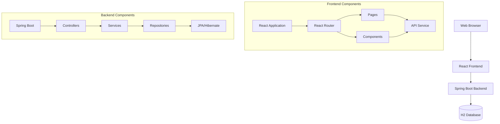
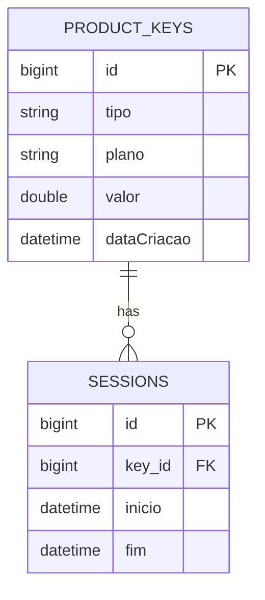

# EvoStore Complete System Documentation

## Introduction

This document provides a comprehensive guide to the EvoStore system, a full-stack e-commerce platform for digital product keys. The system consists of a React frontend and Spring Boot backend, designed with modern architecture patterns and best practices.

## System Architecture Overview



## Documentation Structure

1. [Project Overview](#project-overview)
2. [Getting Started](#getting-started)
3. [Frontend Documentation](#frontend-documentation)
4. [Backend Documentation](#backend-documentation)
5. [API Documentation](#api-documentation)
6. [Deployment Guide](#deployment-guide)

## Project Overview

### Purpose
EvoStore is designed to provide a secure and efficient platform for selling digital product keys with features including:
- Product browsing and purchase
- Key management
- Session tracking
- Administrative controls

### Technology Stack
- Frontend:
  - React.js with Vite
  - React Router DOM
  - Tailwind CSS
  - Axios

- Backend:
  - Spring Boot
  - Spring Web
  - Spring Data JPA
  - H2 Database
  - Swagger/OpenAPI

## Getting Started

### Prerequisites
- Node.js 16+
- Java 11+
- Maven

### Installation

1. Clone the repository
2. Frontend setup:
```bash
cd frontend
npm install
npm run dev
```

3. Backend setup:
```bash
cd backend
mvn clean install
mvn spring-boot:run
```

## Frontend Documentation

### Directory Structure
```
frontend/
├── src/
│   ├── components/     # Reusable UI components
│   ├── pages/         # Page components
│   ├── services/      # API services
│   └── data/          # Static data
```

### Key Components

1. App.jsx
   - Main application container
   - Routing configuration
   - Global state management

2. Components
   - Header.jsx: Navigation and branding
   - ProductCard.jsx: Product display
   - ProductList.jsx: Product grid
   - KeyManager.jsx: Key management

3. Pages
   - Home.jsx: Landing page
   - ProductDetail.jsx: Product information
   - KeyManagement.jsx: Key administration

### State Management
- Local state using useState
- Prop drilling for simple data flow
- API integration through services

## Backend Documentation

### Directory Structure
```
backend/
└── src/main/java/com/evostore/
    ├── config/      # Configuration classes
    ├── controller/  # REST endpoints
    ├── model/       # Data entities
    ├── repository/  # Data access
    └── service/     # Business logic
```

### Key Components

1. Models
   - Key.java: Product key entity
   - Session.java: Usage session entity

2. Controllers
   - KeyController.java: Key management endpoints
   - SessionController.java: Session management

3. Services
   - KeyService.java: Key business logic
   - SessionService.java: Session handling

### Database Schema



## API Documentation

### Key Management

Endpoint: `/keys`

| Method | Endpoint | Description |
|--------|----------|-------------|
| POST   | /keys    | Create key  |
| GET    | /keys    | List keys   |
| GET    | /keys/{id}| Get key     |
| DELETE | /keys/{id}| Delete key  |

### Session Management

Endpoint: `/sessions`

| Method | Endpoint | Description |
|--------|----------|-------------|
| POST   | /sessions | Create session |
| GET    | /sessions/{keyId} | Get key sessions |
| GET    | /sessions/details/{id} | Get session details |

## Deployment Guide

### Frontend Deployment

1. Build the application:
```bash
cd frontend
npm run build
```

2. Deploy the `dist` directory to web server

### Backend Deployment

1. Build the JAR:
```bash
cd backend
mvn clean package
```

2. Run the application:
```bash
java -jar target/evostore-1.0.0.jar
```

## Security Considerations

1. Frontend:
   - Implement authentication
   - Secure API calls
   - Input validation

2. Backend:
   - CORS configuration
   - Input validation
   - Error handling

## Development Guidelines

### Frontend
1. Use functional components
2. Follow Tailwind CSS practices
3. Implement proper error handling
4. Maintain responsive design

### Backend
1. Follow RESTful principles
2. Use proper exception handling
3. Implement validation
4. Maintain transactional integrity

## Testing

### Frontend Testing
- Unit tests for components
- Integration tests for pages
- E2E testing for critical flows

### Backend Testing
- Unit tests for services
- Integration tests for API
- Repository tests

## Maintenance

### Regular Tasks
1. Update dependencies
2. Monitor error logs
3. Database maintenance
4. Performance optimization

### Troubleshooting

1. Frontend Issues:
   - Check browser console
   - Verify API endpoints
   - Review React dev tools

2. Backend Issues:
   - Check application logs
   - Verify database connection
   - Monitor memory usage

## Support

For technical support:
1. Check documentation
2. Review error logs
3. Contact development team

## Version History

Current Version: 1.0.0
- Initial release with core features
- Basic key management
- Session tracking