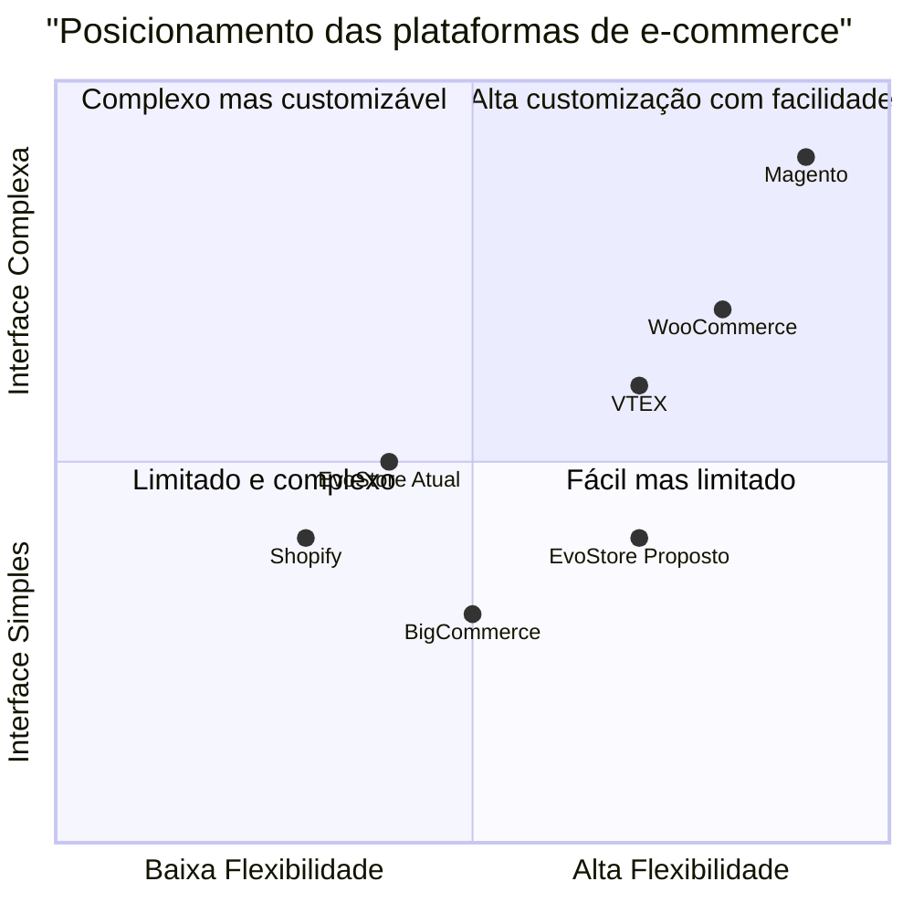
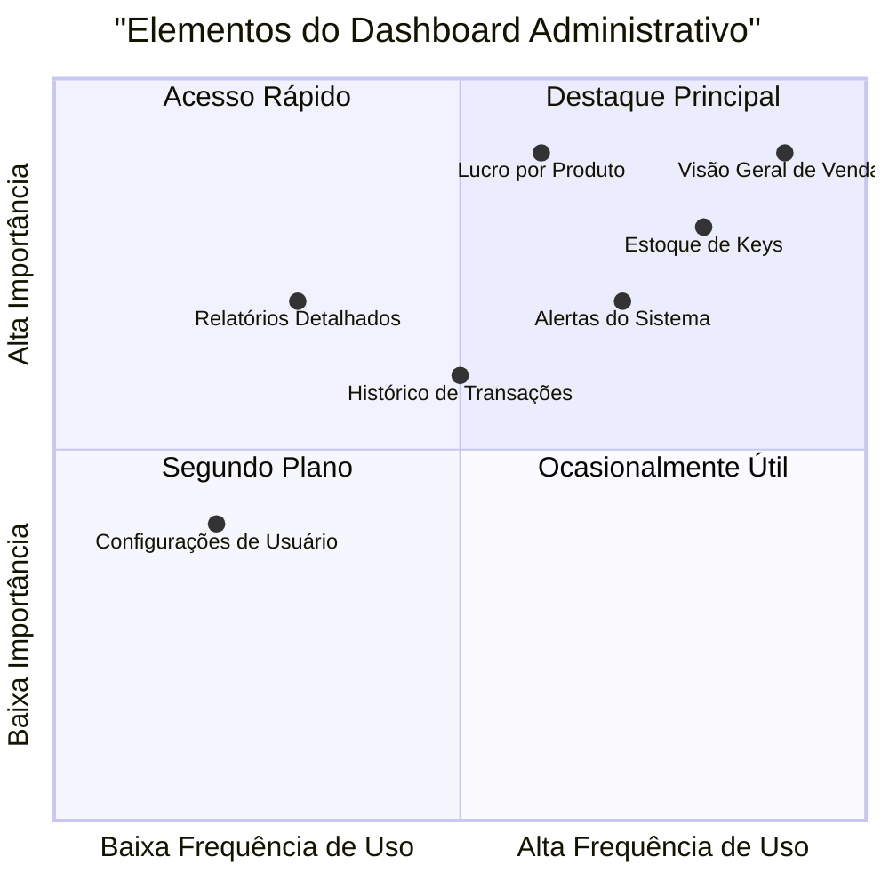

# Relatório de Melhorias para o Sistema EvoStore

Data: 21 de Maio de 2025

## Sumário Executivo

Este documento apresenta uma análise completa e recomendações de melhorias para o sistema EvoStore, um e-commerce desenvolvido com React.js no frontend e Spring Boot no backend. As sugestões foram elaboradas com base nas solicitações específicas do cliente e alinhadas com as melhores práticas de arquitetura de software e experiência do usuário (UX/UI).

As recomendações estão organizadas em três áreas principais:
1. Autenticação e Painel Administrativo
2. Experiência do Usuário (UI/UX)
3. Organização Visual e Código

## 1. Análise da Indústria de E-commerce

### 1.1 Tendências Atuais em E-commerce

Os sistemas de e-commerce modernos estão evoluindo rapidamente, focando em:

- **Experiências personalizadas**: Oferecendo conteúdo adaptado ao perfil e comportamento do usuário
- **Interfaces simplificadas**: Valorizando a limpeza visual e a facilidade de navegação
- **Dashboards analíticos**: Fornecendo insights relevantes para tomada de decisões
- **Segurança avançada**: Implementando sistemas robustos de autenticação e proteção de dados
- **Arquitetura modular**: Facilitando a manutenção e a escalabilidade do sistema

### 1.2 Análise Competitiva

Ao analisar plataformas de e-commerce líderes do mercado, observamos características essenciais que podem ser incorporadas ao EvoStore:

| Plataforma | Pontos Fortes | Pontos de Melhoria |
|------------|--------------|--------------------|
| Shopify | Dashboard administrativo intuitivo, sistema de autenticação robusto | Personalização limitada sem código adicional |
| WooCommerce | Alta flexibilidade, integração com WordPress | Requer mais manutenção técnica |
| Magento | Recursos avançados para grandes lojas, painel administrativo completo | Complexidade de implementação, curva de aprendizado íngreme |
| BigCommerce | Excelente experiência do usuário, dashboard intuitivo | Opções de personalização limitadas em alguns planos |
| VTEX | Solução omnichannel robusta, visualização detalhada de estoque | Interface administrativa pode ser complexa |



## 2. Recomendações para Autenticação e Painel Administrativo

### 2.1 Sistema de Autenticação

#### Recomendações:

1. **Implementação de sistema de login seguro**:
   - Autenticação baseada em JWT (JSON Web Tokens)
   - Tempo de expiração configurável para tokens
   - Armazenamento seguro de credenciais (com hash e salt)
   - Implementação de refresh tokens para melhor experiência do usuário

2. **Autenticação de múltiplos fatores (MFA)**:
   - Opção de 2FA via aplicativo autenticador ou SMS
   - Verificação adicional para operações sensíveis ou acessos de locais não reconhecidos

3. **Hierarquia de usuários**:
   - Usuário comum: acesso limitado a compras e visualização de suas keys
   - Usuário master (admin): acesso completo ao painel administrativo
   - Possibilidade de criação de papéis intermediários para equipes maiores (opcional)

### 2.2 Painel Administrativo

#### Recomendações:

1. **Dashboard principal**:
   - Visão geral de vendas com gráficos intuitivos
   - KPIs principais visíveis imediatamente (receita total, vendas do dia, produtos mais vendidos)
   - Alertas para níveis baixos de estoque de keys

2. **Gestão completa de keys**:
   - Listagem completa de keys com filtros avançados
   - Sistema de registro de compra e venda de keys
   - Controle de estoque com alertas de baixo inventário
   - Histórico de transações por key

3. **Análise financeira**:
   - Relatório de lucros (comparação entre valor de compra e venda)
   - Balanço de vendas com visualização por período (diário, semanal, mensal)
   - Gráficos de desempenho por produto
   - Exportação de relatórios em formatos comuns (CSV, PDF)

4. **Interface do painel administrativo**:



### 2.3 Controle de Acesso

#### Recomendações:

1. **Implementação de Auth Guards no React Router**:
   - Proteção de rotas administrativas
   - Redirecionamento automático para login quando não autenticado
   - Verificação de permissões baseada em papéis

2. **Logs de atividade administrativa**:
   - Registro de todas as ações administrativas para auditoria
   - Histórico de login/logout e tentativas malsucedidas
   - Alertas de segurança para comportamentos suspeitos

## 3. Melhorias de Experiência do Usuário (UI/UX)

### 3.1 Redesign da Interface de Produtos

#### Recomendações:

1. **Cards de produto minimalistas**:
   - Exibição inicial apenas com imagem de alta qualidade do produto
   - Nome do produto em destaque
   - Botão "Ver mais detalhes" posicionado na parte inferior do card

2. **Expansão de detalhes sob demanda**:
   - Implementação de animação suave ao expandir detalhes
   - Exibição de informações completas apenas após clique
   - Organização clara das opções de plano e preço na área expandida
   - Manter a expansão dentro do fluxo da página (sem modais disruptivos)

3. **Modelo de card proposto**:

```
┌────────────────────────┐
│                        │
│      IMAGEM DO         │
│       PRODUTO          │
│                        │
├────────────────────────┤
│     NOME DO PRODUTO    │
├────────────────────────┤
│    VER MAIS DETALHES   │ ← Botão colado na parte inferior
└────────────────────────┘

     ↓ Ao expandir ↓

┌────────────────────────┐
│                        │
│      IMAGEM DO         │
│       PRODUTO          │
│                        │
├────────────────────────┤
│     NOME DO PRODUTO    │
├────────────────────────┤
│   PLANO: Mensal        │
│   PREÇO: R$ XXX,XX     │
├────────────────────────┤
│        COMPRAR         │
└────────────────────────┘
```

### 3.2 Paleta de Cores Refinada

#### Recomendações:

1. **Ajuste do fundo**:
   - Substituir o tom atual (#011901) por um preto mais suave: #121212 ou #0A0A0A
   - Manter contraste adequado para boa legibilidade

2. **Preservação das cores principais**:
   - Manter o verde principal (#02B045) para elementos de destaque
   - Utilizar o verde secundário (#079D3B) para ações complementares
   - Títulos e textos importantes em branco (#FFFFFF) para máximo contraste

3. **Complementos à paleta**:
   - Adicionar tons intermediários para criar profundidade
   - Verde suave (#85E0A9) para indicadores positivos ou sucesso
   - Cinzas sutis (#2A2A2A, #3A3A3A) para separação visual de seções

4. **Aplicação consistente**:
   - Garantir que a nova paleta seja aplicada uniformemente
   - Manter alto contraste para elementos interativos
   - Usar cores para comunicar estados (sucesso, erro, alerta)

### 3.3 Layout Responsivo

#### Recomendações:

1. **Abordagem mobile-first**:
   - Desenhar primeiro para dispositivos móveis e depois escalar para desktop
   - Garantir que todas as funcionalidades sejam acessíveis em qualquer dispositivo

2. **Adaptações específicas**:
   - Cards em grade para desktop (3-4 por linha)
   - Cards em coluna única para mobile
   - Menu compacto (hamburger) para dispositivos móveis

3. **Comportamento de expansão adaptativo**:
   - Em desktop: expansão in-place com animação suave
   - Em mobile: expansão com maior área de toque e rolagem vertical

## 4. Refatoração e Organização de Código

### 4.1 Arquitetura de Componentes React

#### Recomendações:

1. **Estrutura de componentes modular**:
   - Componentes atômicos: botões, inputs, cards básicos
   - Componentes compostos: formulários, seções de produtos
   - Páginas: composição de componentes para formar visualizações completas

2. **Separação clara de responsabilidades**:
   - Componentes de apresentação vs. componentes com lógica
   - Uso de custom hooks para lógica reutilizável
   - Context API para gerenciamento de estado global

3. **Estrutura de diretórios proposta**:

```
src/
├── assets/              # Imagens, ícones e recursos estáticos
├── components/          # Componentes reutilizáveis
│   ├── common/          # Elementos UI básicos (botões, inputs)
│   ├── layout/          # Componentes de estrutura (header, footer)
│   ├── products/        # Componentes relacionados a produtos
│   └── admin/           # Componentes do painel administrativo
├── context/             # Context API e gerenciamento de estado
├── hooks/               # Custom hooks
├── pages/               # Componentes de página
│   ├── public/          # Páginas de acesso público
│   └── admin/           # Páginas do painel administrativo
├── services/            # Serviços de API e integração
├── utils/               # Funções utilitárias
├── styles/              # Estilos globais e temas
└── routes/              # Configuração de rotas (incluindo auth guards)
```

### 4.2 Separação Visual de Áreas

#### Recomendações:

1. **Áreas distintas por função**:
   - Área pública: design voltado ao consumidor
   - Área administrativa: interface funcional e analítica
   - Indicadores visuais claros de qual área está ativa

2. **Sistema de navegação diferenciado**:
   - Menu público: foco em categorias de produtos
   - Menu administrativo: foco em funcionalidades de gestão
   - Transição visual clara ao mudar entre áreas

### 4.3 Implementação de Rotas Protegidas

#### Recomendações:

1. **Configuração de Auth Guards**:
   - Criação de componente PrivateRoute para proteção
   - Verificação de token JWT para acesso a rotas administrativas
   - Redirecionamento para login quando necessário

2. **Exemplo de implementação**:

```jsx
// Exemplo simplificado de implementação de rota protegida
const PrivateRoute = ({ component: Component, roles, ...rest }) => (
  <Route
    {...rest}
    render={(props) => {
      const currentUser = authService.getCurrentUser();
      
      // Verifica se o usuário está logado
      if (!currentUser) {
        return <Redirect to={{ pathname: '/login', state: { from: props.location } }} />;
      }
      
      // Verifica se o usuário tem as permissões necessárias
      if (roles && !roles.includes(currentUser.role)) {
        return <Redirect to={{ pathname: '/' }} />;
      }
      
      // Se passou por todas as verificações, renderiza o componente
      return <Component {...props} />;
    }}
  />
);
```

## 5. Implementação e Priorização

### 5.1 Requisitos Prioritários

| ID | Requisito | Prioridade | Complexidade |
|----|-----------|------------|---------------|
| R1 | Sistema de autenticação básico | P0 | Média |
| R2 | Redesign de cards de produto | P0 | Baixa |
| R3 | Ajuste da paleta de cores | P0 | Baixa |
| R4 | Dashboard administrativo básico | P0 | Alta |
| R5 | Controle de estoque de keys | P1 | Média |
| R6 | Refatoração da estrutura de componentes | P1 | Alta |
| R7 | Relatórios financeiros detalhados | P1 | Alta |
| R8 | Autenticação multi-fator | P2 | Alta |

### 5.2 Plano de Implementação

1. **Fase 1 - Melhorias Básicas de UI/UX**
   - Implementação da nova paleta de cores
   - Redesign dos cards de produto
   - Comportamento de expansão de detalhes

2. **Fase 2 - Autenticação e Segurança**
   - Sistema de login básico
   - Rotas protegidas para área administrativa
   - Separação visual das áreas públicas e administrativas

3. **Fase 3 - Painel Administrativo e Funcionalidades Avançadas**
   - Dashboard com métricas principais
   - Gestão de estoque de keys
   - Relatórios financeiros e de vendas

4. **Fase 4 - Refinamento e Recursos Avançados**
   - Autenticação multi-fator
   - Relatórios avançados
   - Otimização de desempenho

## 6. Perguntas em Aberto

1. Existe alguma preferência por biblioteca específica para gráficos no dashboard administrativo?
2. Há necessidade de integração com sistemas de pagamento específicos?
3. Qual é o volume esperado de keys e usuários que o sistema deve comportar?
4. Existem requisitos específicos de segurança além dos mencionados?
5. Há preferência por alguma biblioteca específica de componentes UI?

## 7. Conclusão

As melhorias propostas neste documento visam transformar o EvoStore em um sistema mais moderno, seguro e fácil de usar, tanto para clientes quanto para administradores. A implementação por fases permitirá entregas incrementais de valor, começando pelas melhorias mais visíveis na interface do usuário e progredindo para funcionalidades administrativas mais complexas.

A nova arquitetura proporcionará maior modularidade e reutilização de código, facilitando a manutenção futura e a adição de novos recursos. As melhorias na experiência do usuário devem resultar em maior engajamento e potencialmente mais conversões, enquanto o painel administrativo robusto fornecerá as ferramentas necessárias para gerenciar o negócio de forma eficiente.

Recomendamos iniciar a implementação pelas melhorias de UI/UX, que podem trazer benefícios imediatos para a experiência do cliente com investimento relativamente baixo.